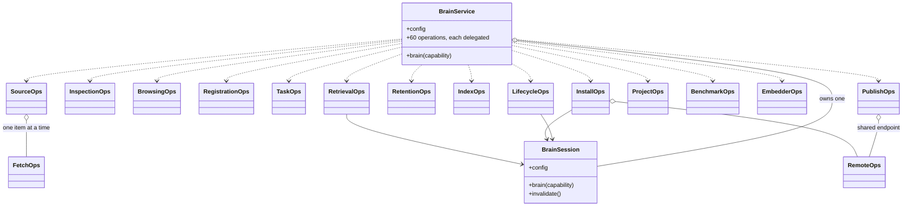

# Architecture

One uv workspace, eight libraries and one app, sharing the PEP 420 namespace `vitruvio`. Dependencies point
downhill only, enforced by `import-linter` in CI rather than by convention.

```
packages/kernel      which brain, who am I, under what policy
packages/stats       the statistics vocabulary indices produce and the planner consumes
packages/embeddings  text and vision embedders, model tags, caching   [torch behind an extra]
packages/indices     the six Index implementations, plus text analysis
packages/planner     the cost-based QueryPlanner and EXPLAIN
packages/ingest      normalization pipelines, candidate proposers, declared sources
packages/runtime     the service layer every interface shares
packages/bench       synthetic corpora and the recall/latency harness  [unpublished]
apps/cli             the CLI, and the TUI it opens                        [dist: vitruvio]
```

## The two contracts that carry weight

**The kernel is the floor.** It imports pydantic and the SDK's value types and nothing heavier. That is
load-bearing: `vitruvio config show` and `vitruvio brain use` must start in tens of milliseconds, and if
configuration lived beside the runtime then importing it would drag in `usearch` and the index registry.

**An app may import `vitruvio.runtime` and `vitruvio.kernel`, and may never import `boltzmann`.** If an app needs an
SDK type, the service layer is missing a method, and adding it there is what makes the same capability available to
all three interfaces instead of one. That is what will keep the future MCP server and HTTP API thin rather than a
third and fourth implementation of the same behaviour.

The one exception that nearly existed — `--actor-kind`, whose values are an SDK enum — was removed by having the CLI
take a string and the kernel coerce it. An exception list in `.importlinter` is a boundary that has started leaking.

## Inside the service layer

`BrainService` is the surface every interface drives — one method per protocol operation, as ADR-0003 has it — and
it delegates each to the domain that owns it. It was one class of 3034 lines, four times the next largest file in
the workspace, and it grew that way because it was the only place an operation could land.



Only three arrows back to the session are drawn; every operations class takes it. That is the load-bearing part
rather than a detail: `InstallOps.pull` advances the pointer and calls `invalidate()`, so a brain handed out
earlier describes the composition that was just replaced. It can only invalidate what it can reach, which is why

> an operations class may hold the session, and may never hold a `Brain`.

| module | operations | capability |
|---|---|---|
| `ops/lifecycle.py` | init, state, verify, history, info | INSPECT, creates |
| `ops/inspection.py` | resolvability, resolve, prove, module, roots | INSPECT |
| `ops/browsing.py` | blocks, content, export_content, related | INSPECT |
| `ops/registration.py` | register, replace, put_content | WRITE |
| `ops/tasks.py` | define_task, task_schema, validate_candidates, commit_candidates, ingest_run, pipelines | RETRIEVE, WRITE |
| `ops/sources.py` | sources, source_kinds, scaffold_source, add_source, remove_source, pull_source, pull_all | INSPECT, WRITE |
| `ops/fetch.py` | one item of a pull: dedup, the redaction guard, registration | — |
| `ops/retention.py` | plan_drop, drop, drop_by_producer, supersede, demote, prune, redact, policy | WRITE |
| `ops/indices.py` | index_list, index_build, index_stats, index_verify, index_gc | INSPECT, RETRIEVE |
| `ops/remote.py` | reference_for, and the client both publishing and installing need | — |
| `ops/publish.py` | pack, registry_check, push, tags | INSPECT, WRITE |
| `ops/install.py` | plan_pull, pull | INSPECT, WRITE |
| `ops/projects.py` | project, add_brain, remove_brain | INSPECT, WRITE |
| `ops/benchmarking.py` | bench | RETRIEVE, over its own corpus |
| `ops/embedders.py` | embedders, test_embedder | — |
| `ops/retrieval.py` | search, explain | RETRIEVE |

`ops/*.py` are the operations, which open brains. `runtime/*.py` beside them — `wire`, `mapping`, `assembly`,
`browse`, `registry`, `distribution`, `indexset`, `vouch`, `query_diagnostics` — are stateless helpers, which do
not. The naming is close enough to be worth stating: `ops/publish.py` publishes, `runtime/distribution.py`
transports; `ops/registration.py` registers a block, `runtime/registry.py` talks to an OCI registry.

`runtime/operation_catalogue.py` is the authoritative list of those protocol operations. It drives the generated
`BrainService` forwarding surface, documentation metadata and conformance checks; `ops/reconcile.py` is marked there
as the deliberate property-exposed exception rather than being absent from the catalogue.

**Heavy imports stay inside functions.** `import vitruvio.runtime` costs ~124ms, and eager `vitruvio.indices`
(+24ms), `asyncio` (+17ms), `stats`, `embeddings` and `bench` would add ~50ms to every invocation, `--help`
included. `packages/runtime/tests/test_import_cost.py` fails if any of them leaks, in a subprocess because by the
time pytest runs it has imported most of them itself.

## Why a cost model rather than a heuristic router

Embedding one query costs about 4.5 ms locally. On a brain of a couple of hundred blocks that is more expensive than
reading the entire module, so "natural language means use the vector index" is simply wrong there — and it runs in
both directions: the same heuristic picks a term scan on a 100k-block brain where a bitmap-masked probe would have
been two orders of magnitude cheaper.

Only a cost model notices. Verified by running the CLI at two scales with the same code: at 3000 blocks `TermScan`
(13.4 ms) beats `SeqScan` (143 ms); at 4 blocks the reverse. Opposite decisions from measured cardinality is the
whole claim.

The reasoning is [ADR-0005](adr/0005-statistics-and-the-cost-model.md); the reader's view is
[chapter 6](guide/06-the-planner.md).

## Where things are written down

- [`docs/guide/`](guide/README.md) — how to use it, in order.
- [`docs/adr/`](adr/README.md) — why it is like this, one file per decision, never renumbered.
- [`skills/`](../skills/README.md) — how an *agent* drives it. Authored once at the repository root and reached
  through a symlink from inside the package, so `vitruvio skills install` ships exactly what is under version
  control.
- `.claude/skills/` — skills for agents working *on* this repository, which is a different audience.
